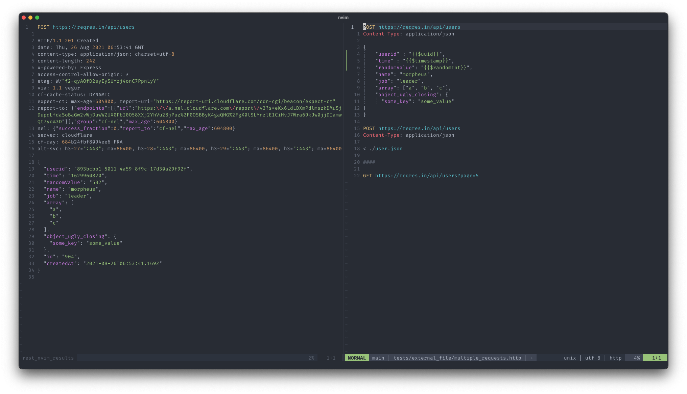

<div align="center">

# rest.nvim


[Features](#features) • [Install](#install) • [Usage](#usage) • [Contribute](#contribute)



</div>

---

A fast Neovim http client written in Lua.

`rest.nvim` makes use of a curl wrapper made in pure Lua by [tami5] and implemented
in `plenary.nvim` so, in other words, `rest.nvim` is a curl wrapper so you don't
have to leave Neovim!

> **IMPORTANT:** If you are facing issues, please [report them](https://github.com/NTBBloodbath/rest.nvim/issues/new)

## Notices

- **2021-11-04**: HTTP Tree-Sitter parser now depends on JSON parser for the JSON bodies detection,
  please install it too.
- **2021-08-26**: We have deleted the syntax file for HTTP files to start using the tree-sitter parser instead,
  please see [Tree-Sitter parser](#tree-sitter-parser) section for more information.
- **2021-07-01**: Now for getting syntax highlighting in http files you should
  add a `require('rest-nvim').setup()` to your `rest.nvim` setup, refer to [packer.nvim](#packernvim).
  This breaking change should allow lazy-loading of `rest.nvim`.

## Features

- Easy to use
- Fast execution time
- Run request under cursor
- Syntax highlight for http files and output
- Possibility of using environment variables in http files

## Install

> **WARNING:** rest.nvim requires Neovim >= 0.5 to work.

### Dependencies

- System-wide
  - curl
  - jq +1.6 (to format JSON output so it can be human-readable)
- Other plugins
  - [plenary.nvim](https://github.com/nvim-lua/plenary.nvim)

### packer.nvim

```lua
use {
  "NTBBloodbath/rest.nvim",
  requires = { "nvim-lua/plenary.nvim" },
  config = function()
    require("rest-nvim").setup({
      -- Open request results in a horizontal split
      result_split_horizontal = false,
      -- Keep the http file buffer above|left when split horizontal|vertical
      result_split_in_place = false,
      -- Skip SSL verification, useful for unknown certificates
      skip_ssl_verification = false,
      -- Highlight request on run
      highlight = {
        enabled = true,
        timeout = 150,
      },
      result = {
        -- toggle showing URL, HTTP info, headers at top the of result window
        show_url = true,
        show_http_info = true,
        show_headers = true,
      },
      -- Jump to request line on run
      jump_to_request = false,
      env_file = '.env',
      custom_dynamic_variables = {},
      yank_dry_run = true,
    })
  end
}
```

### Tree-Sitter parser

We are using a Tree-Sitter parser for our HTTP files, in order to get the correct syntax highlighting
for HTTP files (including JSON bodies) you should add the following into your `ensure_installed` table
in your tree-sitter setup.

```lua
ensure_installed = { "http", "json" }
```

Or manually run `:TSInstall http json`.

## Keybindings

By default `rest.nvim` does not have any key mappings so you will not have
conflicts with any of your existing ones.

To run `rest.nvim` you should map the following commands:
- `<Plug>RestNvim`, run the request under the cursor
- `<Plug>RestNvimPreview`, preview the request cURL command
- `<Plug>RestNvimLast`, re-run the last request

## Settings

- `result_split_horizontal` opens result on a horizontal split (default opens
    on vertical)
- `result_split_in_place` opens result below|right on horizontal|vertical split
    (default opens top|left on horizontal|vertical split)
- `skip_ssl_verification` passes the `-k` flag to cURL in order to skip SSL verification,
    useful when using unknown certificates
- `highlight` allows to enable and configure the highlighting of the selected request when send,
- `jump_to_request` moves the cursor to the selected request line when send,
- `env_file` specifies file name that consist environment variables (default: .env)
- `custom_dynamic_variables` allows to extend or overwrite built-in dynamic variable functions
    (default: {})

## Usage

Create a new http file or open an existing one and place the cursor over the
request method (e.g. `GET`) and run `rest.nvim`.

> **NOTES**:
>
> 1. `rest.nvim` follows the RFC 2616 request format so any other
>    http file should work without problems.
>
> 2. You can find examples of use in [tests](./tests)

---

## Contribute

1. Fork it (https://github.com/NTBBloodbath/rest.nvim/fork)
2. Create your feature branch (<kbd>git checkout -b my-new-feature</kbd>)
3. Commit your changes (<kbd>git commit -am 'Add some feature'</kbd>)
4. Push to the branch (<kbd>git push origin my-new-feature</kbd>)
5. Create a new Pull Request

## License

rest.nvim is [MIT Licensed](./LICENSE).

[tami5]: https://github.com/tami5
